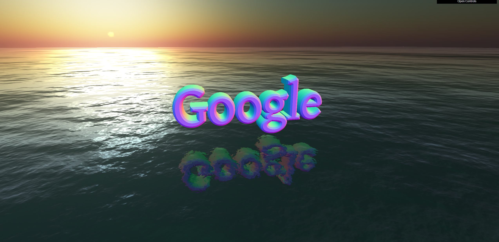

## 3D Web link

### run

- in the file `js/main.js`
  - you can modify the text in line `93`
  - you can modify the link in line `118`

- need Web Server because of `three.js` 

### demo

- click the 3D text can jump to the link

